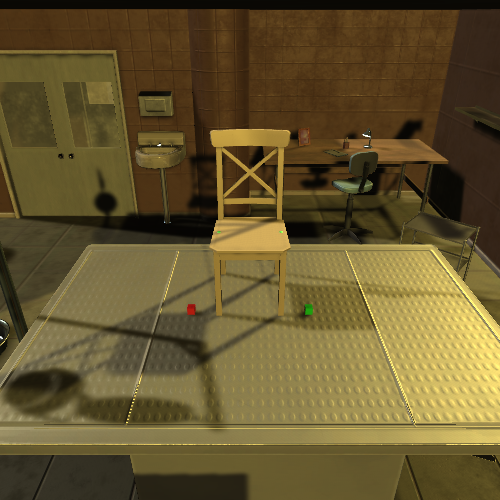
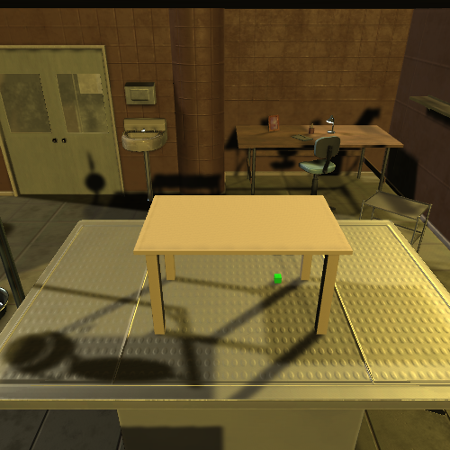
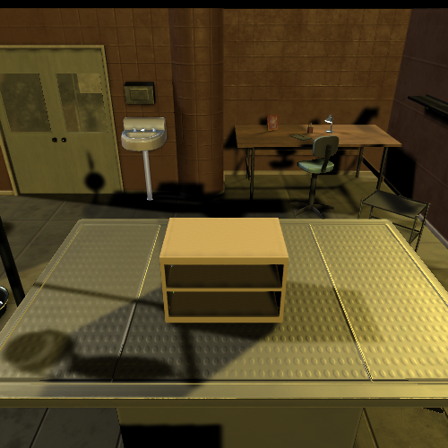
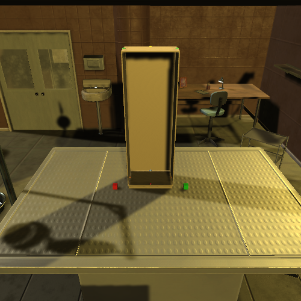
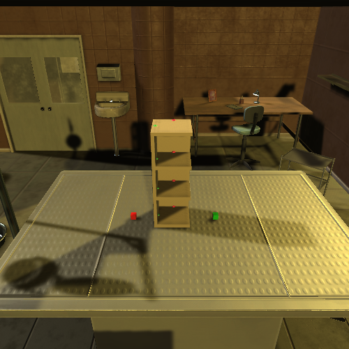
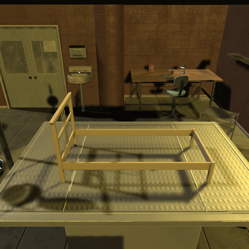

# 大模型辅助的复杂任务规划：任务分解、结构表示与任务分配

本仓库选取 **6 个真实家具装配任务**，展示任务分解、任务分解矩阵（TDM）、多机器人分配及冲突消解结果，并提供主要实验的汇总统计。

## 研究内容

- **大模型多智能体任务分解：**设计任务分类、任务分级和结构生成智能体，结合示例检索与校验反馈，生成子任务及其依赖关系。
- **任务结构表示与推理增强：**提出任务分解矩阵（TDM），设计矩阵编码与图重构算法，并从理论上建立入树型任务图同构类与矩阵等价类的一一对应关系，保证对该类任务图的无损表示。
- **多机器人任务分配与冲突消解：**利用任务结构表示引导大模型预测任务属性、分配机器人，再通过约束检验定位并修复分配冲突。

## 家具模型与任务样例

| 椅子 | 桌子 | 书柜 |
| --- | --- | --- |
|  |  |  |
| 柜体 | 置物架 | 床架 |
|  |  |  |

图片为原家具环境中的模型展示图，不是本研究的机器人实际执行结果。下表中的模型链接提供原始模型文件及其引用的网格文件；矩阵和分配结果可直接打开查看。

| 样例 | 子任务数 | 模型 | 任务结构 | TDM | 初始分配 | 最终分配 | 修复记录 |
| --- | ---: | --- | --- | --- | --- | --- | --- |
| 椅子 | 3 | [模型](models/chair_ingolf_0650.xml) | [结构](examples/01_chair/task.json) | [矩阵](examples/01_chair/tdm.csv) | [分配](examples/01_chair/allocation_initial.csv) | [分配](examples/01_chair/allocation_final.csv) | [结果](examples/01_chair/repair_result.json) |
| 桌子 | 4 | [模型](models/table_bjorkudden_0207.xml) | [结构](examples/02_table/task.json) | [矩阵](examples/02_table/tdm.csv) | [分配](examples/02_table/allocation_initial.csv) | [分配](examples/02_table/allocation_final.csv) | [结果](examples/02_table/repair_result.json) |
| 书柜 | 5 | [模型](models/bookcase_besta_0172.xml) | [结构](examples/03_bookcase/task.json) | [矩阵](examples/03_bookcase/tdm.csv) | [分配](examples/03_bookcase/allocation_initial.csv) | [分配](examples/03_bookcase/allocation_final.csv) | [结果](examples/03_bookcase/repair_result.json) |
| 柜体 | 7 | [模型](models/cabinet_akurum_0014.xml) | [结构](examples/04_cabinet/task.json) | [矩阵](examples/04_cabinet/tdm.csv) | [分配](examples/04_cabinet/allocation_initial.csv) | [分配](examples/04_cabinet/allocation_final.csv) | [结果](examples/04_cabinet/repair_result.json) |
| 置物架 | 5 | [模型](models/shelf_lillagen_0927.xml) | [结构](examples/05_shelf/task.json) | [矩阵](examples/05_shelf/tdm.csv) | [分配](examples/05_shelf/allocation_initial.csv) | [分配](examples/05_shelf/allocation_final.csv) | [结果](examples/05_shelf/repair_result.json) |
| 床架 | 9 | [模型](models/bed_dalselv_0270.xml) | [结构](examples/06_bed/task.json) | [矩阵](examples/06_bed/tdm.csv) | [分配](examples/06_bed/allocation_initial.csv) | [分配](examples/06_bed/allocation_final.csv) | [结果](examples/06_bed/repair_result.json) |

六个样例选自同一轮完整任务规划实验中的成功记录，用于展示具体输入与输出，不构成独立评测集。

## TDM 如何对应任务图和分配结果

以书柜为例，任务图包含两条路径：

```text
T1 → T2 → T3 → T5
T4 ─────────→ T5
```

对应的 [TDM](examples/03_bookcase/tdm.csv) 为：

```text
       路径1  路径2
层级1     1      1
层级2     1      0
层级3     1      0
层级4    -1     -1
```

矩阵以**层级为行、完整路径为列**。数值是结构编码，不是任务编号，也不是邻接关系中的权重。零表示该路径在该层级没有任务；本例末行的两个负编码对应两条路径共享的任务 T5。不同层级上的相同数值不能直接认作同一任务，具体任务身份由位置映射说明：

| 层级 | 路径 1 的任务 | 路径 2 的任务 |
| --- | --- | --- |
| 1 | T1 | T4 |
| 2 | T2 | 无 |
| 3 | T3 | 无 |
| 4 | T5 | T5 |

分配程序按“路径、层级”读取矩阵，因此同时提供转置后的 [分配用矩阵](examples/03_bookcase/tdm_allocation.csv) 和 [任务位置映射](examples/03_bookcase/task_positions.csv)。所有位置均从 **1** 开始编号。分配结果中的第 1 行第 4 列与第 2 行第 4 列都指向 T5，最终均分配给 Robot7，表示同一个共享任务的分配保持一致。

六个样例均提供上述两种矩阵和位置映射。这里公开具体表示结果，矩阵编码与图重构的核心实现保留在研究项目中。

## 机器人配置与分配结果

[机器人能力配置](config/robot_capabilities.json) 和 [机器人状态](config/robot_state.csv) 使用同一轮实验的配置，统一保留 Robot1 至 Robot12 的编号，各样例之间不重新编号。配置包括机械臂类型、负载、速度、技能、连接能力、电量和工作状态。这些数值是实验参数，不作为对应硬件型号的官方参数。

能力配置中的 `connect_units` 表示连接能力单位；双臂机器人可以提供两个单位。`max_load` 为负载参数，其中双臂机器人记录的是单臂负载。状态中的 `idle`、`busy`、`error` 分别表示空闲、忙碌和故障。

每个样例目录中的文件如下：

| 文件 | 内容 |
| --- | --- |
| `task.json` | 基本任务输入、部件、目标连接关系、子任务与依赖边 |
| `tdm.csv` | TDM，层级为行、完整路径为列，无表头 |
| `tdm_allocation.csv` | TDM 的转置，方向与分配结果一致，无表头 |
| `task_positions.csv` | 任务编号与两种矩阵位置的对应关系 |
| `allocation_initial.csv` | 进入局部修复前，模型写出的分配及按当时程序解析后的分配 |
| `allocation_final.csv` | 最终分配及预测的连接能力需求 |
| `repair_result.json` | 修复前后检验标志、发生变化的位置、最终检验结果 |

初始分配文件保留 `model_robot_ids` 与 `parsed_robot_ids` 两列。部分“Robot1, Robot4”形式的原始文本，在旧解析器中只读入了首个机器人。因此，模型文本与解析结果存在差异的记录需要分开理解：**柜体样例中，模型文本与最终分配一致，修复处理的是解析后缺失的分配；不能把它作为模型分配错误的例子。**解析列是按冻结版本的解析函数复核得到的，检验标志则来自当时保存的实验记录。

床架样例的候选输出已经经过一轮结构反馈。该样例还展示了共享任务分配不一致，以及对矩阵空位错误分配机器人的情况。初始文件中没有任务编号的一行对应空位，最终文件中已移除；共享任务的分配也已统一。修复记录保留前后结果，不包含内部搜索过程和完整运行日志。最终检验中的普通冗余计数为 1，该项不属于实验定义的硬约束错误。

[查看六个样例的检验汇总](results/example_checks.csv)

## 主要实验结果

| 实验 | 试验范围 | 成功次数 / 试验次数 | 成功率 |
| --- | --- | ---: | ---: |
| 独立任务分解 | 47 项任务，各重复 5 次 | 199 / 235 | **84.68%** |
| 表示方法对照：不使用 TDM | 60 项任务，各重复 5 次 | 133 / 300 | 44.33% |
| 表示方法对照：使用 TDM | 60 项任务，各重复 5 次 | 244 / 300 | **81.33%** |
| 独立任务分配 | 60 项任务、5 种模型，各重复 5 次 | 1484 / 1500 | **98.93%** |
| 完整任务规划 | 47 项任务，各重复 5 次 | 197 / 235 | **83.83%** |

- 表示方法对照统计的是反馈和修复之前的初始候选分配可行率，使用 TDM 后提高 **37 个百分点**。
- 独立任务分配以人工确认的任务结构为输入，统计包含反馈与修复的流程结果。
- 完整任务规划使用实际生成的任务分解结果，任务分解与最终分配均成功才计为成功；它与独立任务分配的实验条件不同。
- 表中数据来自已保存的实验统计。本仓库仅整理所选样例，未重新运行全部实验。可行性对应实验定义的离散任务结构与执行约束，不代表实体机器人完成装配或运动轨迹验证。

[下载实验汇总表及统计口径](results/summary.csv)

## 提示词与模型接口大纲

[提示词大纲](interfaces/prompt_outline.json) 仅列出任务分类、分级、结构生成、属性预测与分配、检验反馈各阶段的输入输出；[模型调用接口](interfaces/model_api.py) 仅给出调用签名；[配置示例](interfaces/model_config.example.json) 中的地址、密钥与模型名称均为空。

这些接口文件用于说明各阶段如何衔接，未实现真实模型调用。使用本仓库查看矩阵、模型和结果无需密钥；公开文件不包含真实提示词、示例检索库或在线服务配置。

## 目录与使用方式

```text
examples/     六个样例的任务结构、TDM、初始分配和修复结果
models/       六个原始模型文件及其引用的 45 个网格文件
images/       六张原家具环境图片
config/       本轮实验使用的机器人能力和状态
interfaces/   提示词、模型调用和配置的大纲
results/      样例检验汇总与主要实验统计
third_party/ 原家具环境的许可文件
```

直接打开上方链接即可查看样例；也可以下载整个仓库。模型目录保留原始相对路径，模型文件引用的网格文件位于同名子目录内。模型文件是原家具环境的资源组件，完整仿真仍需原环境的场景及运行依赖。

## 来源与公开范围

家具模型和图片来自 [IKEA Furniture Assembly Environment](https://github.com/clvrai/furniture)，随附[原项目许可](third_party/furniture-LICENSE.txt)。任务分解、矩阵与分配结果来自本研究筛选的实验记录。

本仓库用于展示研究内容和部分真实结果。完整实验数据、未发表工作的核心实现、真实提示词、内部日志与后续研究资料未公开，所附材料不足以复现完整研究实验。
