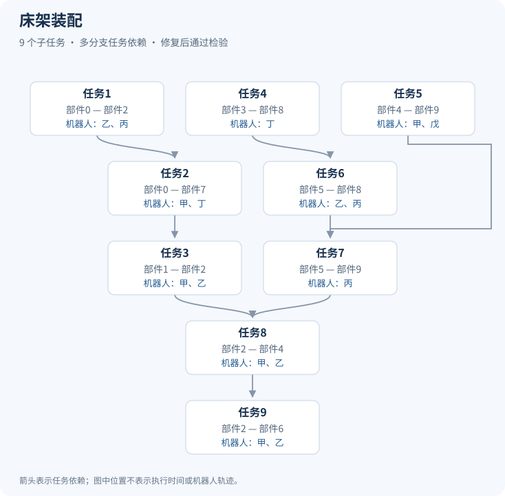

# 大模型辅助的复杂任务规划：样例与实验结果

本项目展示复杂装配任务从任务分解、任务结构表示到多机器人任务分配的研究工作。仓库提供 **6 个真实实验样例**、任务依赖图、最终分配结果及主要实验的汇总统计。

## 研究内容

- **大模型多智能体任务分解：**设计任务分类、任务分级和结构生成智能体，结合示例检索与校验反馈，将任务信息转化为子任务及其依赖关系。
- **复杂任务结构表示：**提出任务分解矩阵（TDM），设计矩阵编码与图重构算法，并从理论上建立入树型任务图同构类与矩阵等价类的一一对应关系，保证对该类任务图的无损表示。
- **多机器人任务分配与冲突消解：**利用任务结构表示引导大模型预测任务属性、分配机器人，并通过约束检验和修复处理分配冲突。

## 六个任务样例

| 样例 | 子任务数 | 展示特点 | 本次分配结果 |
| --- | ---: | --- | --- |
| [椅子装配](docs/01_chair.md) | 3 | 简单串行依赖 | 初始分配通过检验 |
| [桌子装配](docs/02_table.md) | 4 | 重复连接任务 | 初始分配通过检验 |
| [书柜装配](docs/03_bookcase.md) | 5 | 两条分支汇合 | 修复后通过检验 |
| [柜体装配](docs/04_cabinet.md) | 7 | 多机器人协作 | 修复后通过检验 |
| [置物架装配](docs/05_shelf.md) | 5 | 层板连接任务 | 初始分配通过检验 |
| [床架装配](docs/06_bed.md) | 9 | 多分支任务依赖 | 修复后通过检验 |

每个样例包含基本部件信息、目标连接关系、子任务依赖图和最终机器人分配。以下为床架装配样例：



六个样例均选自同一轮完整任务规划实验中的成功记录，用于说明不同任务结构与分配结果；它们不是独立评测集，整体表现见下表。机器人编号已在各样例内重新命名。

## 实验结果

| 实验 | 试验范围 | 成功次数 / 试验次数 | 成功率 |
| --- | --- | ---: | ---: |
| 独立任务分解 | 47 项任务，各重复 5 次 | 199 / 235 | **84.68%** |
| 表示方法对照：不使用任务分解矩阵 | 60 项任务，各重复 5 次 | 133 / 300 | 44.33% |
| 表示方法对照：使用任务分解矩阵 | 60 项任务，各重复 5 次 | 244 / 300 | **81.33%** |
| 独立任务分配 | 60 项任务，5 种模型，各重复 5 次 | 1484 / 1500 | **98.93%** |
| 完整任务规划 | 47 项任务，各重复 5 次 | 197 / 235 | **83.83%** |

- 表示方法对照统计的是**反馈和修复之前的初始候选分配可行率**，使用矩阵后提高 **37 个百分点**。
- 独立任务分配实验以人工确认的任务结构为输入，统计包含反馈与修复的分配流程结果。
- 完整任务规划使用实际生成的任务分解结果，只有任务分解与最终分配均成功才计为成功。因此，98.93% 与 83.83% 对应不同实验条件，不能互换。
- 上述结果反映实验中定义的离散任务结构与执行约束检验，不代表实体机器人完成装配或运动轨迹验证。

[下载汇总统计表](results/summary.csv)

## 文件与使用方式

| 路径 | 内容 |
| --- | --- |
| `examples/` | 六个经过筛选的任务输入与最终结果 |
| `docs/` | 各样例的中文说明 |
| `figures/` | 根据样例数据绘制的任务依赖图 |
| `results/summary.csv` | 主要实验的汇总统计与指标口径 |
| `codes/render_examples.py` | 离线生成说明页和依赖图的脚本 |

直接打开上方样例链接即可浏览。也可在本地使用 Python 3.9 或更新版本重新生成说明页和图片，无需额外安装依赖：

```bash
python3 codes/render_examples.py
```

该脚本读取已保存的样例数据，检查基本引用关系并生成图文，不调用大模型，也不重新运行原实验的完整可行性检验。

## 数据来源与公开范围

装配任务基于 [IKEA Furniture Assembly Environment](https://github.com/clvrai/furniture)。本仓库展示研究实验中筛选的任务描述、规划结果及据此绘制的依赖图，原环境及其资源的权利归原作者所有。

当前提供的是研究展示材料，部分研究仍在投稿。完整数据、核心算法实现、提示词、检索示例库、模型接口配置、机器人完整能力参数及内部修复记录未纳入本仓库；所附样例不足以复现完整实验。
