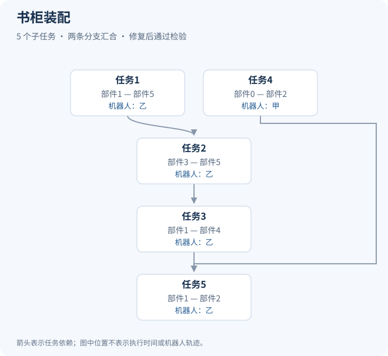

# 书柜装配

[返回项目说明](../README.md)

原始任务编号：`bookcase_besta_0172`。本例展示两条分支汇合，共 5 个子任务。

## 任务输入

任务指令：组装这个书柜。

| 部件 | 几何类别 |
| --- | --- |
| 部件0 | 竖向薄板 |
| 部件1 | 竖向薄板 |
| 部件2 | 横向薄板 |
| 部件3 | 竖向薄板 |
| 部件4 | 横向薄板 |
| 部件5 | 横向薄板 |

目标连接关系：部件0与部件2；部件1与部件2；部件1与部件4；部件1与部件5；部件2与部件3；部件3与部件4；部件3与部件5。

输入仅展示基本部件信息与连接关系，实验使用的完整属性和执行条件未包含在本页。

## 任务依赖与最终分配

| 子任务 | 连接操作 | 分配的机器人 |
| --- | --- | --- |
| 任务1 | 连接部件1与部件5 | 机器人乙 |
| 任务2 | 连接部件3与部件5 | 机器人乙 |
| 任务3 | 连接部件1与部件4 | 机器人乙 |
| 任务4 | 连接部件0与部件2 | 机器人甲 |
| 任务5 | 连接部件1与部件2 | 机器人乙 |

目标连接关系描述装配对象的连接要求，上表展示最终规划中的连接子任务，二者数量不必相同。

## 实验结果

本次记录中的任务分解和完整规划均成功。初始分配未通过检验，经修复后通过。

机器人编号已在本例内重新命名；不同样例中的同名机器人不表示同一个执行体。最终可行性来自原实验检验记录，本页不包含完整约束配置或内部修复过程。

[查看结构化样例数据](../examples/03_bookcase.json)
